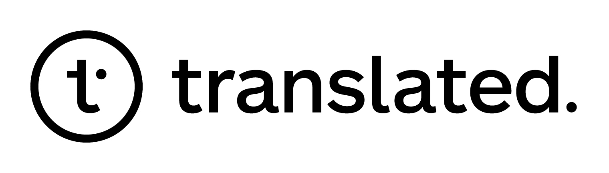

In response to the on-going crisis, several academic (Carnegie Mellon University, Johns Hopkins University) and industry (Amazon, Appen, Facebook, Google, Microsoft, Translated) partners have partnered with the Translators without Borders to prepare COVID-19 materials for a variety of the world's languages to be used by professional translators and for training state-of-the-art Machine Translation (MT) models. The focus is on making emergency and crisis-related content available in as many languages as possible. The collected, curated and translated content across nearly 90 languages will be available to the professional translation as well the MT research community.

To this end, we have so far created:

## Translation Memories for the Translation Community

We have combined the terminologies and other translation data to create translation memories in .tmx format for the majority of the language pairs. 

* Additional details and data download [here](memories.html).

## Translated Terminologies
Translations of covid19-related terms in dozens of languages and locales, provided by Facebook and Google.

* Download all terminologies [here](data/terminologies.zip) (zip file, 0.8MB).
* Complete list and details [here](terminologies.html).

## TICO-19 Translation Benchmark

The benchmark will include 30 documents (3071 sentences, 69.7k words) translated from English into 36 languages:
Amharic, Arabic (Modern Standard), Bengali, Chinese (Simplified), Dari, Dinka, Farsi, French (European), Hausa, Hindi, Indonesian, Kanuri, Khmer (Central), Kinyarwanda, Kurdish Kurmanji, Kurdish Sorani, Lingala, Luganda, Malay, Marathi, Myanmar, Nepali, Nigerian Fulfulde, Nuer, Oromo, Pashto, Portuguese (Brazilian), Russian, Somali, Spanish (Latin American), Swahili, Congolese Swahili, Tagalog, Tamil, Tigrinya, Urdu, Zulu.

* Download the evaluation set [here](data/tico19-testset.zip) (zip file, 12MB).
* Paper describing the creation of the dataset [here](data/paper/ticopaper.pdf).
* Paper, Results, and more details [here](testset.html).

## Other data sources

Other COVID19-related collections from our contributors and our friends (which might not be available under a permissive license!):

* The [Translators Without Borders](https://translatorswithoutborders.org/) have compiled [glossaries](https://translatorswithoutborders.org/twb-glossary-for-covid-19/) and are starting to provide [translations](https://translatorswithoutborders.org/translations-covid-19/).
* [Neulab](http://www.cs.cmu.edu/~neulab/) members and other collaborators have collected several resources (especially crawled monolingual news data) in this [GitHub repo](https://github.com/neulab/covid19-datashare).
* Microsoft has published Covid-19 related desktop searches from Bing. They are [here](https://github.com/microsoft/BingCoronavirusQuerySet).
* [The Endangered Languages Project](http://endangeredlanguages.com/) has aggregated community-produced information in more than 600 languages! Data [here](https://endangeredlanguagesproject.github.io/COVID-19/).
* [TAUS](https://www.taus.net/) has compiled a corpus of COVID-19-related parallel sentences. Available [here](https://md.taus.net/corona). Note that these corpora are published under the CC BY-NC 4.0 license which means the data can be shared and modified only for non-commercial purposes.  
* An international team of scientists that tries to estimate the number of cases with COVID-19 symptoms in different countries have put out [surveys](https://github.com/GCGImdea/coronasurveys/blob/master/surveys.md) in 57 languages. (HT: @juliakreutzer)
* The [COVID-19 Myth Busters in World Languages](https://covid-no-mb.org/) has information in 60+ languages.
* The [EMEA corpus](http://opus.nlpl.eu/EMEA.php) provides pdf conversions of documents from the European Medicines Agency (22 languages, 231 bitexts).
* SketchEngine has collected an [English in-domain corpus](https://www.sketchengine.eu/covid19/).
* Amazon has created a [public data lake for analysis of COVID-19 data](https://aws.amazon.com/blogs/big-data/a-public-data-lake-for-analysis-of-covid-19-data/).

## Media Communications

The effort has been featured in:

* [Wired article](https://www.wired.com/story/covid-language-translation-problem/) by [Gretchen McCulloch](https://gretchenmcculloch.com/) Title: "Covid-19 Is History’s Biggest Translation Challenge"
* [Facebook AI Blog](https://ai.facebook.com/blog/using-ai-to-help-health-experts-address-the-covid-19-pandemic) Title: "Using AI to help health experts address the COVID-19 pandemic"
* [Announcement from TWB](https://translatorswithoutborders.org/TICO-19-announcement) Title: "TWB partners with tech leaders to develop COVID-19 language technology for 37 languages"
* [Slator article](https://slator.com/machine-translation/twb-big-tech-academia-take-on-covid-19-language-challenge/) Title: "TWB, Big Tech, Academia Take on Covid-19 Language Challenge"
* [DevEx article](https://www.devex.com/news/opinion-covid-19-calls-for-disrupting-the-way-we-communicate-in-a-crisis-97641) Title: "Opinion: COVID-19 calls for disrupting the way we communicate in a crisis"
* [Language Magazine article](https://www.languagemagazine.com/2020/07/27/covid-translation-initiative-takes-off/) Title: "COVID Translation Initiative Takes Off"

## Contact

Contact us at:   `tico19 [dot] 2020 [at] gmail [dot] com`.

## Invitation for Contributions

We make a public call for community contributions to the TICO-19  project.

* You can contribute by translating the TICO-19 benchmark in more languages. Ideally, the benchmark will grow to cover as many of the world's languages as possible! However, we note that a large portion of the benchmark includes medical terminology which is important to accurately translate. Thus, we strongly encourage that professional translators handle the technical content, and that you follow a rigorous process of Quality Assurance (e.g. a process similar to the one described in our paper) over the produced translations. Reach out to us and we will be glad to provide details on our QA process.
* If you are a professional translator and have already produced COVID-19 related content, you can share your translation memory and we will combine and release it with ours. Similarly, if you have compiled terminologies with COVID-19 terms, or if you find errors in our published terminologies, reach out and we will update them accordingly.
* You can volunteer with Translators without Borders (TWB) if you are fluent in at least one language other than your native language. Whether you are interested in translating medical texts or translating for crisis response, there are engaging projects available to suit all preferences. Professional translators are especially encouraged to apply. Click here to complete the [Translator Application Form](https://trommons.org/register).

All community contributions will be properly acknowledged and labeled as such.

## Contributors

| | |
| :----: | :----: | :----: |
|  |  |  |
|  |  |  |
|  |  |  |

After the first phase of the project is completed, we will make a call for further community contributions, stay tuned!

## License
All content is made publicly available through a Creative Commons [CC0](LICENSE.md) license.
